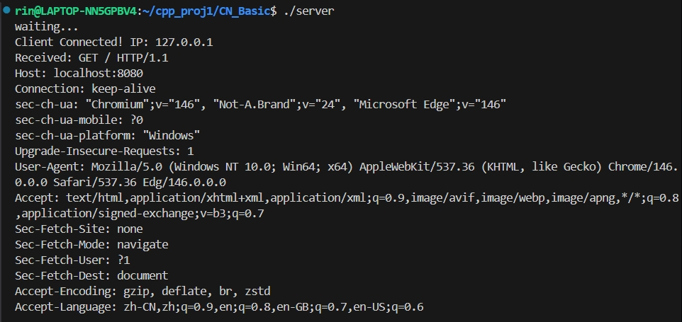
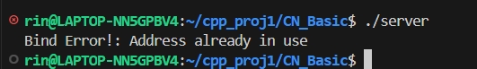

由于本人此前只有使用cpp写算法题，而从未涉及网络编程与实际项目，了解这个项目需要从漫长的基础概念补全开始。

## 2026.3.23：网络编程初探，Socket与文件传输

首先，socket是怎么回事？
要从零构造一个webserver，其本质是考虑主机之间的通信，因此先要对IP地址，port以及TCP/IP都是些什么东西有一个基本的认识。
查询资料知，socket的构造基于TCP/IP协议栈，这些协议规定了数据传输的流程与规则。我们可以用IP地址唯一地指定一台网络设备，由于一个网络设备上有大量不同应用，端口用于确定通信传输的数据要传输到哪一个应用上。
在此基础上，socket(套接字)是一条不同主机和不同应用之间的虚拟数据通道，主要有两种：TCP/UDP，TCP连接最重要的性质是可靠性，通过超时重传保证另一方一定能够按顺序收到我方发出的数据包。特征：发起连接，不重复不丢失，按顺序传输。
UDP(用户报文协议)以报文为单位传输数据，由于不存在重传机制，这样的传输方式更快，延迟更低，占用资源更少，相应地，连接不安全。

我们默认通信的两个设备一个是客户端，一个是服务端，两边可以通过socket互相传输信息。对服务端而言，socket由bind()方法绑定到某个特定的IP与端口，然后调用listen()开始被动监听，等待客户端socket发来连接请求(三次握手)后accept()，要断开时，客户端发送close()，两者断开连接(四次挥手)。

## 2026.3.24: TCP_Server的基础构建

在此基础上，我们可以开始写一个基础TCP Server。首先需要注意到主机端和网络端的存储字节序问题，主机端往往使用小端序，反之网络端被指定为大端序，为了解决两者混用可能导致的数据误读问题，在网络通信过程中必须予以转换：调用转换函数htons(),htonl()来分别完成短整型和长整型从主机端到网络端的端序转换，反之则是ntohs(),ntohl()。

其次，IP地址底层是32位数字，但实际往往用字符串进行描述，因此用inet_pton(int af, const char *src, void *dst)来将主机字节序的字符串转化为网络字节序的整形，const char *inet_ntop(int af, const void *src, char *dst, socklen_t size)反之。发现网络到主机多了一个size参数，用于标记dst指向内存的存储内容大小。而且其返回值是传出参数对应的字符串内存地址。

关键函数：socket()创建一个套接字，有三个传入参数，分别用于指定协议族协议，数据传输协议(STREAM/DGRAM)，协议。成功会返回一个正的文件描述符，凭借这个文件描述符可以操作某一块指定内存。

建立sockaddr_in类结构体，将指向的内存进行拆分，允许指定协议族，端口号，IP地址（后两者必须转化为计算机需要的形式）。
运用bind时，必须将更智能的地址表单sockaddr_in转换为其能认识的sockaddr！
调用listen方法，将socket转为被动监听状态，准备接收来自客户端的请求，注意其参数backlog，当接收到的请求超出这个参数时，请求不会纳入排队！
accept函数抓取一个请求，返回一个新的文件描述符，并且后面的一切读写都对新的文件描述符进行操作。注意：第三个传入参数必须时socklen_t*类型，用int会导致报错！
当通信通道建立后，调用 recv() 读取数据，调用 send() 发送数据。
用浏览器作为客户端去访问我们的服务器时，recv收到的是一大段按特定格式排列的纯文本字符串，即HTTP 请求报文。

效果展示：

新的问题：Address already in use报错

## 2026.3.26:基础单线程TCP_Server的完善

经过了解，我发现address already in use问题本质上是TCP规定关闭连接的一方进入一段time_wait时期，既能够确保不会让旧报文影响新的连接，也保证对方收到报文。Server代码规定服务器主动关闭连接，因此8080端口进入TIME_WAIT，使用netstat命令排查可以看见8080端口的TIME_WAIT状态。为了使得端口可以复用，需要在bind前面加入setsockopt()方法，设置REUSEADDR，使其允许绑定time_wait中的端口。这能够大大提升效率。

到此，server已经能够完成一次性的监听，接收，关闭了，但是我们想要的不是一个只能使用一次的服务器，而应该不断监听来自客户端的需求。因此我们考虑在accept前加一个死循环，保证服务器一直在监听，确保能在任何时候接收到请求并进行处理。相应地，当socket接收失败时不应该弹出错误并return，而应该跳过接收下一个请求。到此为止，一个基本的TCP_Server就完成了。

## 2026.3.27:多线程的基础知识学习
先前我所实现的，是一个最为基础的单线程TCP服务器，它的关键特征是“每一次只能处理一个请求，在这个请求的处理过程中，其他请求都被阻塞，这严重影响了这个服务器的可用性，自然而然地，我想到用多线程来解决这个问题，在多线程并发过程中，每个线程可以独立运行不同的任务，但它们的资源并不独立拥有，而是依赖创建它们的进程而存在。这意味着同一进程内的不同线程可以很方便地进行数据沟通和通信，使得其相对于进程更适用于并发操作。然而其更高的灵活性也意味着程序员需要做更多的工作来确保资源的正确分配，它们需要以正确的操作顺序被利用，同时必须避免死锁产生。

### Thread对象的构造方式
为了进行多线程编程，c++用thread库来进行线程对象生命周期和资源分配的管理。
thread对象主要有三种构造方式：其一是先构造一个无参thread对象，再进行移动赋值，表现为将一个临时线程的所有权转换给当前对象。其次是带可变参数的构造方式，总共支持传入三类可调用对象：函数指针，仿函数和lambda表达式。最后是移动构造，也即将一个已经存在的线程的所有权转换到当前对象。
thread对象构造的一个重要特点是**禁止拷贝，支持移动**，线程资源无法拷贝，但是线程所有权可以进行转让。

### Thread库核心成员函数
最核心的成员函数是join()，它的作用是让当前线程等待一个线程完成，若该线程未执行完毕，那么当前线程也没有办法继续进行，必须阻塞等待该线程执行完毕。与之对应的是detach()，也就是将当前线程和创建的线程分离，两者分别执行。在分离出来的线程执行完毕后将其资源回收。用来描述一个线程能否执行join()方法的函数是joinable()，**join()和detach()都会将线程变为非joinable状态**。非joinable的线程还有以下两类:**无参构造的线程对象**和**状态已经被转移给其他线程的对象**，这总共三类线程都是非joinable的无效线程，**被销毁的线程必须是无效线程**！

### 当前线程操作函数
std::this_thread中提供操作当前线程的工具函数。
get_id用于获取当前线程的id；
sleep_for和sleep_until用于线程休眠，两者的区别是for用于休眠一段时间，until则是休眠到一个固定时间点，两者的差别从名字就可以看出来。
yield表示该线程主动让出当前时间片把资源交给其他线程

**值和引用问题**
线程函数的参数默认按值拷贝到线程内部，即使线程函数的参数是引用类型，在线程函数中修改后也影响不到实参本身。如果要传入引用使得内部操作影响实参，必须在构造thread对象过程中借助std::ref函数

## 2026.3.30 mutex的基本认识

大凡多线程管理，总要涉及到资源共享和线程安全问题，当多个线程同时读写共享资源时，可能会产生数据不一致或者冲突。锁的意义就是确保同一时刻只有一个线程可以访问共享资源，本质是保持数据一致性和准确性。互斥量mutex就是用来保证每个线程的访问过程不被其他线程打断的机制。

### 为什么需要Mutex
每个线程拥有自己独立的栈结构，但是全局变量等临界资源是直接被多个线程共享的。当不同的线程同时操作全局变量时，可能导致冲突，次数越多表现越明显，所以在多线程编程中，需要对共享资源进行适当的同步控制，加锁保护是实现这一点的关键手段。

### 四类互斥锁
std::mutex是最基本的互斥量，对象之间**既不能拷贝也不能移动。**
基本mutex主要有三类方法：lock,try_lock,unlock，作用十分显然。比如说两个线程同时对某个全局变量进行修改，加锁之后，任意时刻只有一个线程能修改，这就避免了竞争。
在加锁的时候，要注意加锁的位置。

std::recursive_mutex，意为递归互斥锁，主要用在递归加锁的场景中。
普通锁的特点是重复加锁导致阻塞，假如有这么一个函数：
void func(int n){
	if(n== 10){
	return;
	}
	mtx.lock();
	n++;
	func(n);
	mtx.unlock()
}
第一次上锁后，还没有解锁就递归调用函数再上一次锁，使用普通mutex会导致此处产生阻塞，这种抢到了锁但是无法申请再次上锁的情况就是死锁。
recursive_mutex的解决方法时，它使得自己持有锁资源的时候无需再做申请。

std::timed_mutex为时间互斥锁，具备定时解锁的功能。若到时间未解锁就自动解锁。其中有两种方法：try_lock_for和try_lock_until，一个表示相对时间一个表示绝对时间点。

最后一种锁是std::recursive_timed_mutex，对时间互斥锁有递归方面升级。

### RAII风格锁
RAII是现代C++编程的重要特点之一，翻译为资源获取即初始化，将资源的生命周期与对象的生命周期绑在一起，利用自动析构保证资源的释放。对于mutex来说RAII的思想尤为重要，因为手动加锁解锁会面临巨大的死锁风险，是对程序员的严峻考验。
void dangerousFunction(int id) {
    try {
        // 使用 RAII 风格的锁管理
        std::lock_guard<std::mutex> lock(mtx);

        std::cout << "Thread " << id << " is running." << std::endl;

        // 模拟异常情况，抛出异常
        if (id == 1) {
            throw std::runtime_error("Thread 1 encountered an error!");
        }

    } catch (const std::exception& e) {
        std::cerr << "Exception caught in thread " << id << ": " << e.what() << std::endl;
    }

}

int main() {
    try {
        std::thread t1(dangerousFunction, 1);
        std::thread t2(dangerousFunction, 2);

        t1.join();
        t2.join();
    } catch (const std::exception& e) {
        std::cerr << "Exception caught: " << e.what() << std::endl;
    }

    return 0;
}
这样的一段代码是对RAII思想的体现，对象lock在创建时调用mtx.lock()，每次离开try作用域时都会调用析构函数进行unlock，保证锁被成功释放。

容易发现，此处并没有直接的unlock方法，而是采用了lock_guard类，用于实现资源的自动加锁和解锁，是RAII思想的体现，确保在作用域结束时自动释放锁资源。

lock_guard有以下特点：
**自动加锁**：创建对象时立即对互斥量加锁，确保进入临界区前已获得锁。
**自动解锁**：作用域结束时自动释放互斥量，避免资源泄漏和死锁。
**适用局部锁定**：通过栈上对象实现，只适用于局部范围的互斥量锁定。

另一个重要模板类是unique_lock，std::unique_lock 是 std::lock_guard 的增强版，提供了更灵活的加锁 / 解锁控制，支持延迟加锁、手动解锁、与条件变量配合使用等场景。
具备以下核心特点：
**灵活的加解锁时机**：可以手动调用 lock()/unlock()，不需要在创建时立即加锁。
**支持延迟加锁**：创建对象时可以选择不立即加锁，后续再手动获取锁。
**可与条件变量（std::condition_variable）配合**：实现复杂的线程同步与等待机制。
**RAII 保障**：生命周期结束时仍会自动解锁，避免资源泄漏。

在此基础上，unique_lock由于其灵活性，可以脱离lock_guard局部加锁的拘束，甚至可用get_lock方法把锁作为返回值传出去。

### 条件变量()
std::condition_variable 是 C++ 标准库中用于线程间条件同步的类，核心是等待-通知机制：
线程可以调用 wait 系列函数，主动进入等待状态，直到某个条件满足。
另一个线程在条件满足时，调用 notify_one/notify_all 唤醒等待的线程。

**重要方法：**
wait(unique_lock<mutex>& lock)：使当前线程进入无限等待，直到被notify_one()/notify_all()唤醒。调用时会自动释放锁，被唤醒后会重新获取锁。

wait_for(unique_lock<mutex>& lock, duration)：使线程最多等待指定时长，超时或被唤醒时返回。返回值：
std::cv_status::timeout：等待超时
std::cv_status::no_timeout：被唤醒

wait_until(unique_lock<mutex>& lock, time_point)：使线程等待到指定绝对时间点，超时或被唤醒时返回，返回值同 wait_for。

notify_one()：唤醒一个正在等待的线程（如果有多个，随机选一个）。

notify_all()：唤醒所有正在等待的线程。

关键特点与注意点：
必须配合 std::unique_lock 使用：
wait 会在等待时自动释放锁，这要求锁必须支持手动解锁，所以只能用 std::unique_lock，不能用 std::lock_guard。
虚假唤醒：
线程可能在没有调用 notify 的情况下被唤醒，所以必须在循环中检查条件，不能只判断一次：

while (!condition) {
    cv.wait(lock);
}
等待时释放锁
调用 wait 后，锁会被释放，让其他线程可以修改共享变量；被唤醒后，wait 会重新获取锁，保证临界区安全。

至此，我可以完成两个小练习，利用unique_lock和condition_variable模拟多线程工作，实现一个计数器和两个线程交替打印，熟悉“等待某条件成立”的多线程操作模式。并在此基础上，完成一个多生产者多消费者的模型，全面深化理解。

## 2026.4.1 Mutex,condition_variable，RAII思想构建PC模型

一、核心组件：模板编程练习
1. 核心成员
mutable std::mutex mtx：重点！const 成员函数（如 get_size）需加锁，mutable 允许 const 方法修改锁
两个条件变量：not_full（唤醒生产者）、not_empty（唤醒消费者）
stop_：停止标志，需加锁修改，避免信号丢失
max_size：队列容量，const 成员，构造函数初始化
2. 核心接口
构造函数：explicit 禁止隐式转换，带默认容量，符合多线程类规范
push：用unique_lock（配合条件变量），wait 避免虚假唤醒，std::move减少拷贝，生产后唤醒消费者
pop：同 push 逻辑，wait 等待队列非空，消费后唤醒生产者，严格判断 “stop_+ 队列空” 才退出
stop：用lock_guard，加锁修改 stop_+notify_all，避免死锁
get_size：const 方法，必须加锁，返回 size_t

二、生产者 / 消费者函数
生产者：随机休眠模拟生产耗时，生成唯一任务 ID，调用 push，检查返回值判断是否停止
消费者：循环消费，pop 阻塞等待任务，模拟处理耗时，收到停止信号则退出
三、主线程控制
用emplace_back创建线程（不用手动写 std::thread，原地构造，高效）
先 join 生产者：确保所有生产完成，再进入收尾（避免生产中停止队列）
休眠：本来硬停止两秒，后来考虑到实际情况改为每500ms轮询
调用 stop：唤醒所有阻塞线程，发送退出信号
join 消费者：确保所有任务处理完毕，安全退出

四、核心知识点
RAII 锁：lock_guard（简单场景用，轻量）、unique_lock（条件变量必须用，灵活），自动加解锁，避免死锁
条件变量：必须配合 unique_lock，wait 自动释放 / 重加锁，循环判断条件避免虚假唤醒
线程安全：所有操作共享资源（队列、stop_）必须加锁，杜绝数据竞争
避免死锁：stop 加锁、单一锁、notify_all 唤醒所有线程，无循环等待

## 2026.4.2 线程池基础
有了学习生产者消费者模型的基础，我下一步决定学习基础线程池的构建。
最根本的问题是，我们为什么需要一个线程池？
在我学习完多线程编程基本知识后，对原先的单线程循环服务器进行优化，改为每有一个访问请求就创造一个新的线程让它去跑，主线程无需考虑它的情况。然而，每有一个请求就要创造一个线程，线程执行完毕后还有销毁的过程，这种操作流程带来了巨大的额外开销，甚至还有崩溃的风险。为了解决这个问题，我们考虑进行线程的固定复用，即一开始就创造固定数量的工作线程，让它去任务队列里反复取任务，执行完之后不销毁，而是等待下次进行复用。
在实现过程中，我逐步理清了线程池的四大核心组件及其协作逻辑：
**任务队列 queue<function<void()>>**：用来存放待执行的任务。function<void()>是C++11的通用可调用对象包装器，能把普通函数、lambda等统一封装成任务，直接用task()即可执行。
线程数组vector<thread>：预先创建并管理固定数量的工作线程，实现线程复用。
互斥锁mutex：整个线程池只使用一把锁，专门保护共享的任务队列，避免多线程竞争导致数据混乱。特别需要注意的是，**锁的作用域至关重要，只在操作队列时加锁，任务执行时必须释放锁，否则会严重阻塞其他线程，这是高并发的关键**。
条件变量condition_variable：统一管理所有工作线程，没有任务时让线程休眠以节省 CPU，有任务时唤醒线程，退出时唤醒所有线程安全结束。

特别注意地：使用 atomic<bool> 作为停止标记，保证多线程下安全关闭线程池，析构时等待所有线程执行完毕再退出。
最终完成的线程池完整实现了生产者消费者模型：submit 作为生产者向队列添加任务，工作线程作为消费者循环取任务执行，实现了一个线程安全的线程池。
